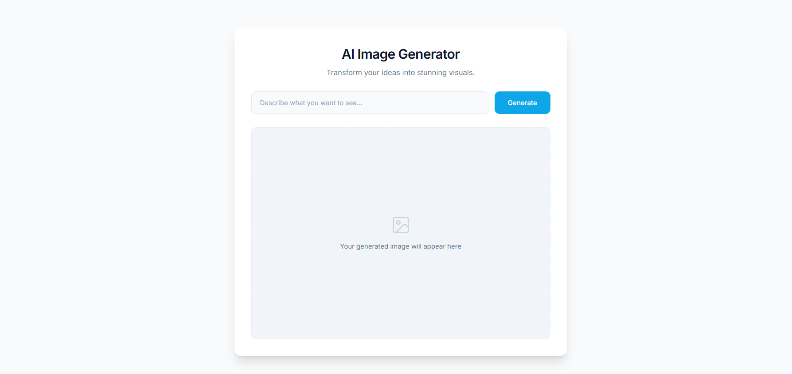
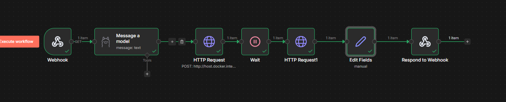
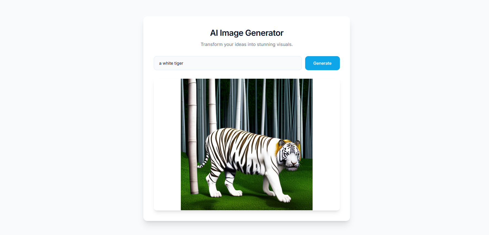

# AI Image Generator Pipeline (n8n + ComfyUI + LLM)

An end-to-end AI image generation system that enhances user prompts using an LLM and generates images using ComfyUI via an automated n8n workflow.

---

## Features

- Prompt input via frontend UI
- LLM-based prompt enhancement
- Automated workflow using n8n
- Image generation using ComfyUI (Stable Diffusion)
- Asynchronous handling using prompt_id + history API
- Image returned dynamically to frontend

---

##  Architecture

Frontend → Webhook → LLM → ComfyUI (/prompt) → Wait → ComfyUI (/history) → Response

---

## Screenshots

### UI

### Workflow (n8n)

### Output

---

## Tech Stack

- HTML, CSS, JavaScript
- n8n (automation)
- ComfyUI (Stable Diffusion)
- Docker (GPU runtime)
- LLM (prompt enhancement)

---

##  How It Works

1. User enters a prompt in the frontend
2. Webhook sends prompt to n8n
3. LLM enhances the prompt
4. n8n sends workflow JSON to ComfyUI
5. ComfyUI generates image
6. n8n fetches result via `/history`
7. Image URL is returned to frontend

---

## Project Structure
 frontend/ → UI files
 workflow/ → n8n workflow JSON
 screenshots/ → demo images

---

## Note

- Requires local ComfyUI setup
- Requires GPU for optimal performance

---

##  Future Improvements

- Style presets (anime, realistic, etc.)
- Image history gallery
- Download button
- Cloud deployment
